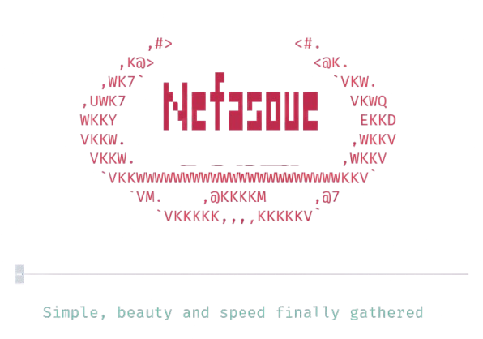

# Nefasque Neovim



---

## Fetures

> Minimalist interface
> fast user experience
> Integrated mini-nvim
> rapid script execution
> Color Theme obtained from the Xresources Archive 

---

## Used Plugins

+ [Sonokai](https://github.com/sainnhe/sonokai) (Theme colorscheme)
+ [Lazy](https://github.com/folke/lazy.nvim) (Plugins manager)
+ [Mini-Nvim](https://github.com/echasnovski/mini.nvim) (Core)
+ [Blick](https://github.com/saghen/blink.compat) (Completion)
+ [Windsurf](https://github.com/Exafunction/windsurf.nvim) (AI Completion))
+ [friendly-snippets](https://github.com/rafamadriz/friendly-snippets) (Snippets)
+ [hlargs.nvim](https://github.com/m-demare/hlargs.nvim) (Highlight arguments)
+ [mason.nvim](https://github.com/williamboman/mason.nvim) (LSP)
    - [mason-lspconfig.nvim](https://github.com/williamboman/mason-lspconfig.nvim) (LSP)
    - [mason-lspconfig.nvim](https://github.com/WhoIsSethDaniel/mason-tool-installer.nvim) (Third tools)
+ [Stay centered](https://github.com/arnamak/stay-centered.nvim) (Centering Cursor)
+ [Vimade](https://github.com/tadaa/vimade) (Focus Mode)
+ [Toggleterm](https://github.com/akinsho/toggleterm.nvim) (Term Manager)
+ [Donut](https://github.com/NStefan002/donut.nvim) (Donut)
+ [nvim-treesitter](https://github.com/nvim-treesitter/nvim-treesitter) (tree code)
+ [Conform](https://github.com/stevearc/conform.nvim) (formatters_by_ft)
+ [Markdown Preview](https://github.com/adalessa/markdown-preview.nvim) (Markdown Preview)

--- 

## Xresources Color
> The colors are extracted from Xresources files <CR>
> The variables used are

```
#define base00 #2C1C2C
#define base01 #a6bDe8
#define base02 #5872BC
#define base03 #6cb4a3
#define base04 #e38B88
#define base05 #BD2C4C
#define base06 #9575CD
#define base07 #D2D7DE
#define base08 #eaeaea
#define baseg1 #332133
#define baseg2 #3f2a3f
#define baseg3 #4f314f
#define baseg4 #7a517a

*.gray1: baseg1
*.gray2: baseg2
*.gray3: baseg3
*.gray4: baseg4

*.color0:       base00
*.color1:       base01
*.color2:       base02
*.color3:       base03
*.color4:       base04
*.color5:       base05
*.color6:       base06
*.color7:       base07
*.color8:       baseg4
*.color9:       base01
*.color10:      base02
*.color11:      base03
*.color12:      base04
*.color13:      base05
*.color14:      base06
*.color15:      base07
*.color16:      base08
*.color256:     base08
*.color257:     baseg2
*.color258:     color1

*.colorRed: base05
*.colorGreen: base03
*.colorYellow: base04
*.colorBlue: base02
*.colorPurple: base06
*.colorCyan: base01

```


